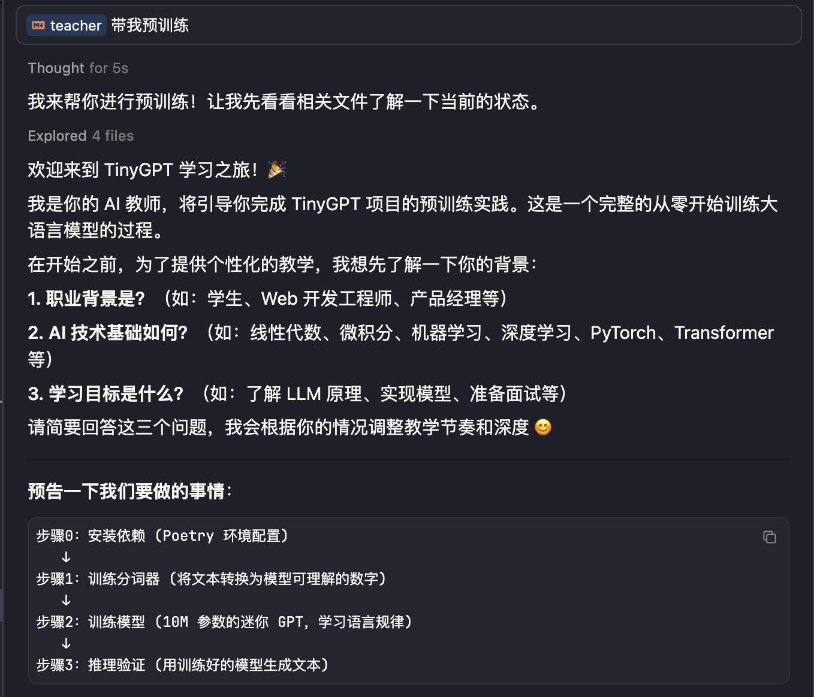

# TinyGPT 🤖

> TinyGPT 旨在帮助非 AI 领域的开发者轻松理解大语言模型的核心原理

---

### ✨ 特性

*   **完整训练流程**: 涵盖从 **预训练、SFT 到 DPO**
*   **低门槛**: 无需云端 GPU，同时兼容 Mac M 芯片
*   **为学习而生**:
      * 内置 **[@teacher AI](/teacher.md)**，引导式教学
      * 不追求性能和效果，仅使用经典算法做入门实现
      * 有类型注释，懂的都懂 🤷🏻‍♀️...


### 🚀 开始吧！

> 每个章节相互独立，可任意开始

也可直接让老师带你，比如：

```bash
# 在 Cursor，Claude Code 或任何带 Bash Tool 的环境中：
@teacher 带我预训练
```




*   [预训练](/a_pretrain/README.md): 手搓 10M 的超小模型（比 Qwen3-0.6B 还要小 60 倍）
*   [SFT](/b_sft/README.md) (WIP): Qwen3-0.6B 版加法器
*   [DPO](/c_dpo/README.md) (WIP): 反向安全对齐，Qwen3-0.6B 越狱破限


## 🙏 鸣谢 & 拓展学习推荐

> 没看以下资料之前我也是门外汉一枚，成功不一定能复制，但学习一定可以！

* [Minimind](https://github.com/jingyaogong/minimind): 学习参考了很多，感谢 jingyaogong 大佬。推荐作为进阶学习项目
* [从零构建大模型](https://book.douban.com/subject/37305124/): 豆瓣 9.3 分，对初学者非常友好
* [王木头学科学](https://www.bilibili.com/video/BV1XH4y1T76e/?vd_source=4a37854f1727b85c1376f579e932bde9): 如果想理解 Why，强烈推荐
